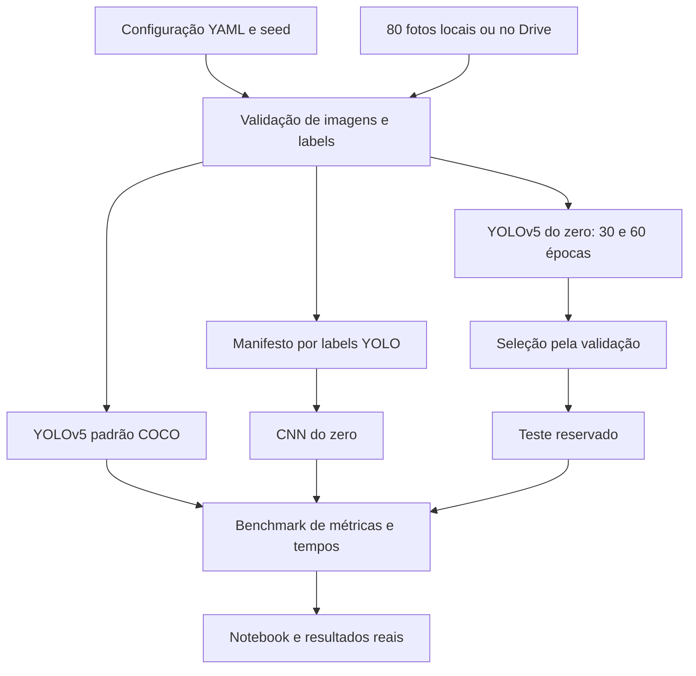

# Arquitetura da Fase 6

Todo o código Python está em células do notebook principal: configuração,
validação, manifesto, comandos YOLO, inferência, CNN, métricas e benchmark.
As células de funções antecedem sua utilização e devem ser executadas na ordem
apresentada. Não existem módulos Python locais ou pasta de testes na entrega.
Definir as funções não instala dependências, baixa pesos ou inicia treinamento.

Configuração versionada usa caminhos relativos; o YAML gerado em `.runtime/`
usa caminhos absolutos do ambiente corrente para o runtime externo YOLO.
`dataset_root` permite integrar Drive sem modificar configurações versionadas.

Artefatos pesados ficam em `.runtime/` e `runs/`, ignorados pelo Git. Resultados
consolidados só são gerados depois de execução real. A inferência salva as oito
imagens processadas de teste; todos os outputs acadêmicos vêm de execução real.

A seleção customizada utiliza exclusivamente validação. A CNN seleciona o
checkpoint pela menor val_loss. Os testes das três abordagens usam os mesmos
arquivos; não use imagens externas na comparação principal.

O preflight exige GPU nos dois frameworks, dataset aprovado e runtime v7.0.
ZIPs são extraídos somente por ação explícita, com SHA-256, CRC e validação dos
membros, sem sobrescrita. O manifesto versionado identifica o pacote revisado.

Checkpoints/runs ficam diretamente no Drive, por sessão. Pequenos resultados
são preservados após cada etapa e exportados em um ZIP de devolução separado.
A recuperação valida a configuração, hardware, fingerprint e checkpoint;
ela não retoma automaticamente treinos interrompidos.

A seleção YOLO usa mAP50_95, mAP50, menor duração real e menos épocas.
O benchmark distingue detection/classification, média/mediana/desvio padrão,
campos indisponíveis e métricas próprias de cada tarefa.

O teste customizado usa val.run oficial com o modelo não fundido, dataloader
do split reservado e ComputeLoss, em FP32. As losses são efetivamente calculadas;
zeros de inicialização de uma avaliação sem ComputeLoss não são tratados
como métricas. A execução real desse adaptador em GPU permanece pendente.

A melhor época é registrada pelo callback oficial `on_model_save` quando o YOLOv5 grava `best.pt`, evitando inferir empates a partir do CSV arredondado. O treino usa `train.main` e os mesmos argumentos oficiais, sem alterar a implementação do YOLOv5. Referências: [treinamento v7.0](https://github.com/ultralytics/yolov5/blob/v7.0/train.py) e [callbacks v7.0](https://github.com/ultralytics/yolov5/blob/v7.0/utils/callbacks.py).
