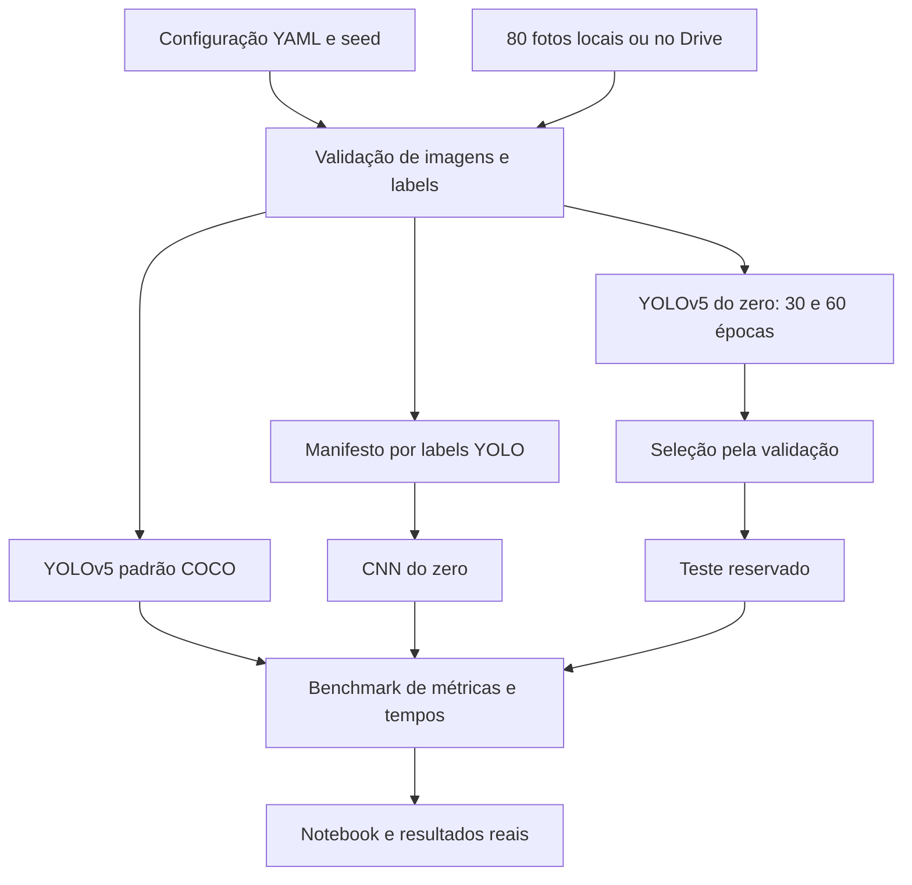

# Arquitetura da Fase 6

Todo o código Python está em células do notebook principal: configuração,
validação, manifesto, comandos YOLO, inferência, CNN, métricas e benchmark.
As células de funções antecedem sua utilização e devem ser executadas na ordem
apresentada. Não existem módulos Python locais ou pasta de testes na entrega.
Definir as funções não instala dependências, baixa pesos ou inicia treinamento.

Configuração versionada usa caminhos relativos; o YAML gerado em `.runtime/`
usa caminhos absolutos do ambiente corrente para o runtime externo YOLO.
`dataset_root` permite integrar Drive sem modificar configurações versionadas.

Artefatos pesados ficam em `.runtime/` e `runs/`, ignorados pelo Git. Resultados
consolidados só são gerados depois de execução real. Imagens de evidência têm
um limite padrão de três por inferência de detecção.

A seleção customizada utiliza exclusivamente validação. A CNN seleciona o
checkpoint pela menor val_loss. Os testes das três abordagens usam os mesmos
arquivos; não use imagens externas na comparação principal.
